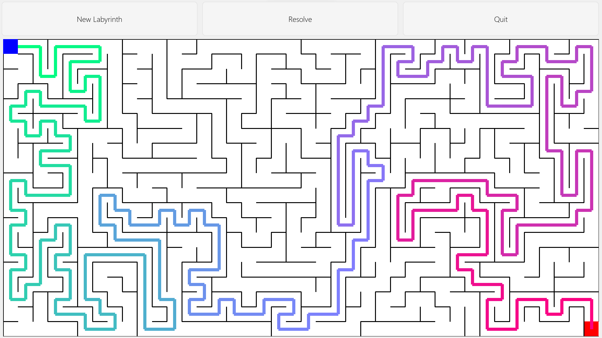
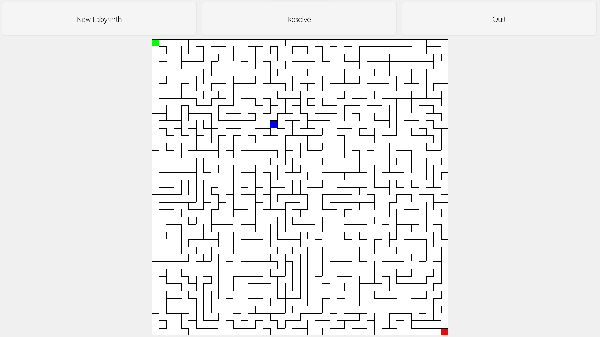
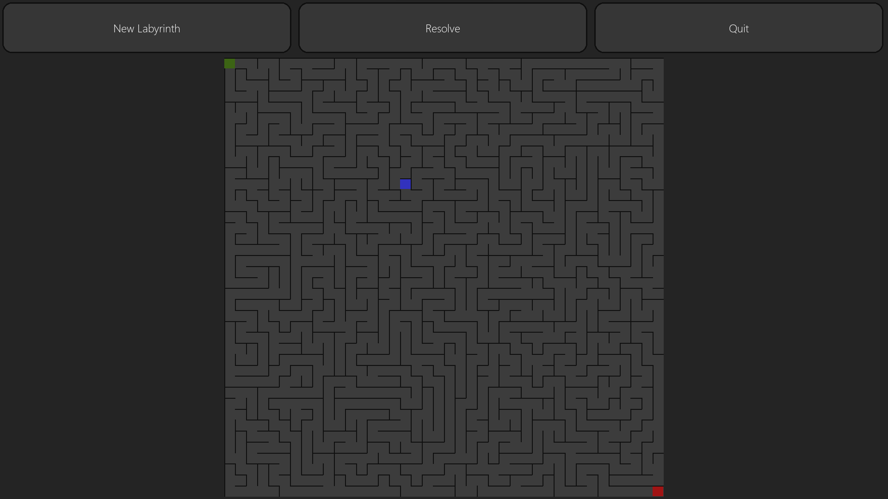
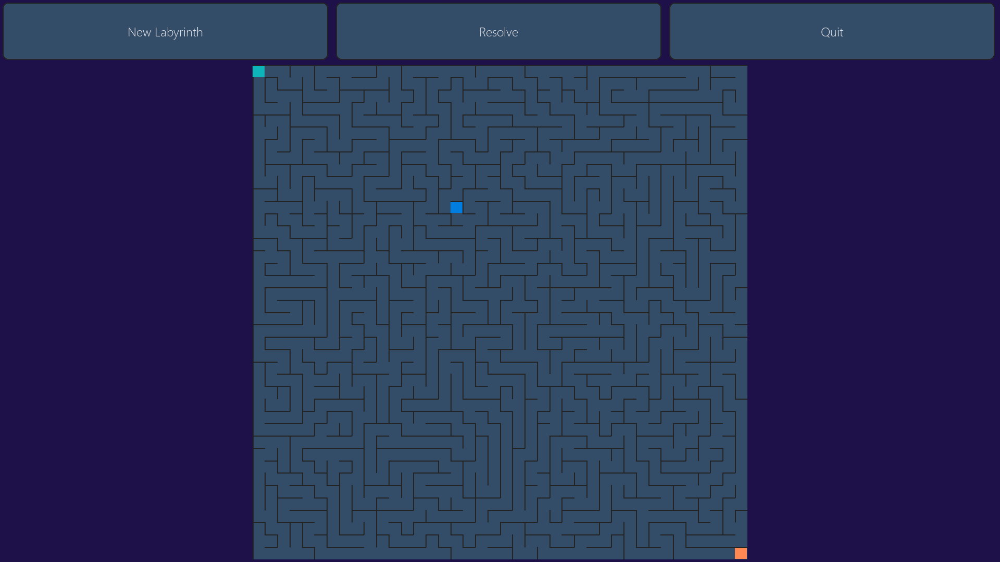
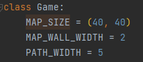

# PYTHON LITTLE MAZE GAME

## The game

By double clicking the py-little-maze/main.py file, you will discover a new wor.. no. It is just a little game made with
pygame, which generates mazes of configurable size, as many times as you want. Once you resolved the maze, another one
is automatically generated. If this is too hard, you can click 'Resolve' to see the solution appear.

<i> 40 x 20 maze after clicking on resolve</i>

## Themes

The game supports several themes between which you can switch by pressing space. New themes can be added by adding a
.json file in the theme directory, and adding its path in the tuple themes of the `main` function (main.py)

<i> Light, dark and marine themes </i>

## Configuring size

For the moment, the maze size, the wall width and the path resolution width have to be configured by hand. This can be
done in the `Game` class, by changing `MAP_SIZE`, `MAP_WALL_WIDTH` and `PATH_WIDTH` respectively. 

